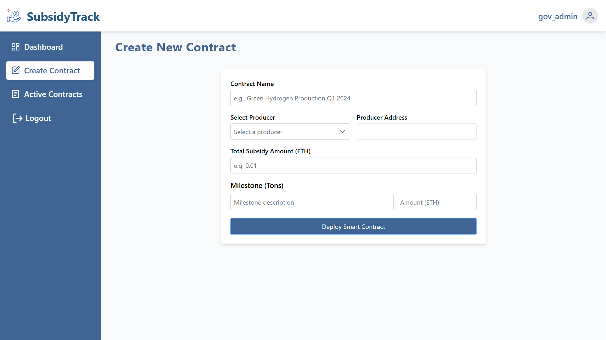
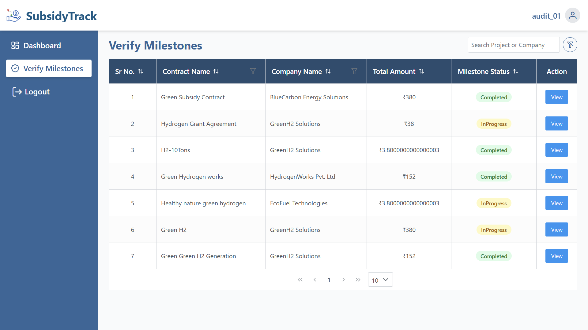

# SubsidyTrack

## Description

The SubsidyTrack is a web portal built using the MERN stack, Tailwind CSS, and PrimeReact. It allows
governments to create subsidy schemes, producers to submit milestone data with proofs, and auditors
to verify the submissions. Smart contracts on the blockchain ensure that fund release conditions are
automatically checked and tracked. Authentication and authorization are handled using JWT (JSON Web
Tokens), with distinct roles for Government, Producer, and Auditor.

## Features

### Government

-   **Create Subsidy Schemes:** Governments can create subsidy schemes with total amount,
    milestones, and assign producers.
-   **Fund Deposits:** Governments can deposit funds into smart contracts.
-   **View Transactions & Reports:** Governments can track which milestones are completed and funds
    released.

### Producer

-   **Submit Milestones:** Producers can submit milestone data, including quantity generated and PDF
    proofs.
-   **View Status:** Producers can see which milestones are approved, pending, or rejected.
-   **Receive Funds:** Once milestones are verified, smart contracts automatically release funds.

### Auditor

-   **Verify Submissions:** Auditors can review milestone submissions from producers.
-   **Approve or Reject:** Auditors approve verified submissions, which triggers fund release via
    smart contracts.
-   **Track Audit History:** Auditors can see historical verification records.

## Tech Stack

-   **Frontend:**
    -   React
    -   Tailwind CSS
    -   PrimeReact
-   **Backend:**
    -   Node.js
    -   Express.js
-   **Database:**
    -   MongoDB
-   **Blockchain:**
    -   Ethereum (Smart Contracts)
    -   Solidity
-   **Authentication & Authorization:**
    -   JWT (JSON Web Tokens)

## Setup Instructions

### Prerequisites

-   Node.js (v14 or later)
-   MongoDB
-   Ganache or any local blockchain for testing (optional)

### Installation

1. **Clone the repository:**

    ```bash
    git clone https://github.com/Dhruv0104/Hackout.git
    cd Hackout
    ```

2. **Install dependencies for both client and server:**

    ```bash
    # For client
    cd client
    npm install

    # For server
    cd server
    npm install
    ```

3. **Create a `.env` file in the server directory and add the following environment variables:**

    ```
    PORT=
    MONGODB_URI=
    JWT_SECRET=
    BLOCKCHAIN_URL=
    PRIVATE_KEY=
    ```

4. **Add blockchain config (if using local testnet or Ganache):**

    - • `BLOCKCHAIN_URL` → RPC URL of blockchain
    - • `PRIVATE_KEY` → Private key of government account

5. **Run the application:**

    ```bash
    # For client
    cd client
    npm run dev

    # For server
    cd server
    npm start
    ```

6. **Access the application:**

    ```bash
    Open your browser and go to http://localhost:5173
    ```

# Usage

## Government

### Registration:


### Login:


### Dashboard:


### Create New Contract



### Monitor Contracts:


### Contract Logs:


### Fund Deposits: Deposit funds into smart contract

View Transactions & Reports: Track milestones and fund release.

## Producer

### Dashboard:


### Producer Subsidies:


### Submit Milestones:


## Auditor

### Dashboard:


### Verifcation By Auditor:



### Contract Logs:


